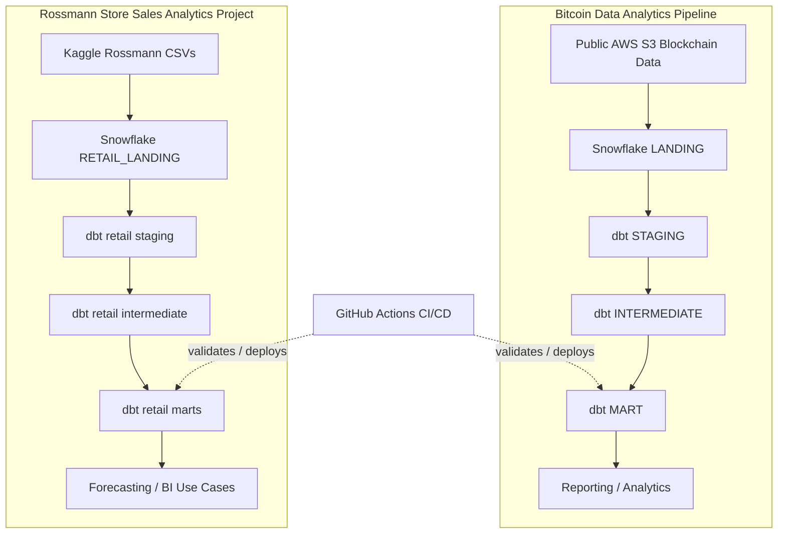
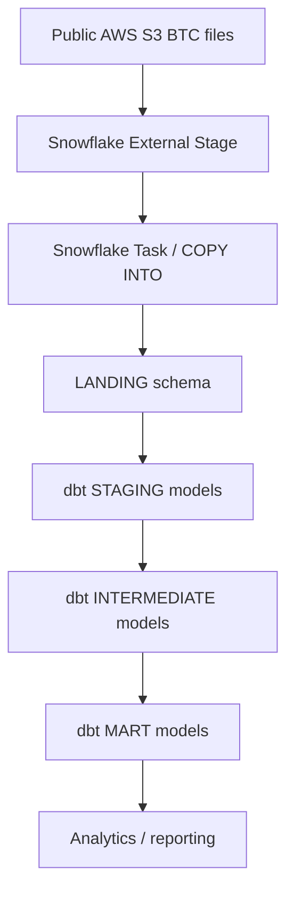
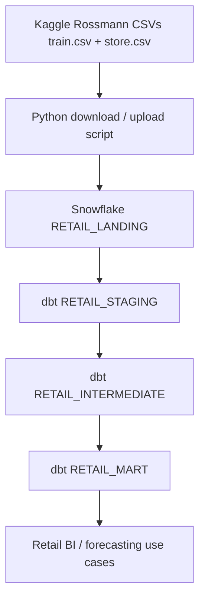

# Snowflake dbt Analytics

This repository contains two data engineering projects built with **Snowflake**, **dbt Core**, and **GitHub Actions**.

1. **Bitcoin Data Analytics Pipeline** - a Snowflake + dbt pipeline for blockchain transaction data.
2. **Rossmann Store Sales Analytics Project** - a Snowflake + dbt pipeline for retail warehouse design based on the public Kaggle Rossmann Store Sales dataset.

The repository is organized so that the folder structure, dbt layers, Snowflake setup, and workflow files are easy to follow in one place.

---

## Overview

This repository shows data loading into Snowflake, transformation with dbt, testing, and environment movement with GitHub Actions.

- **Bitcoin project**: public blockchain data loaded into Snowflake and modeled through landing, staging, intermediate, and mart layers.
- **Rossmann project**: retail sales data modeled into a forecasting-ready Snowflake + dbt warehouse.
- **Automation**: GitHub Actions workflow files for DEV validation and TEST/PROD deployment.

---

## Architecture Overview



Both projects follow the same Snowflake + dbt pattern.

---

## Tech Stack

| Component | Technology |
|-----------|------------|
| Data Warehouse | Snowflake |
| Transformation | dbt Core |
| CI/CD | GitHub Actions |
| Language | SQL, Python |
| Environment | Python virtual environment + `dbt-snowflake` |
| Source Data | Bitcoin blockchain public data, Kaggle Rossmann Store Sales |
| Modeling Style | Landing, Staging, Intermediate, Mart |
| Advanced Modeling | Snapshots, incremental models, dbt tests |

---

## Project 1: Bitcoin Data Analytics Pipeline

### Scope

The Bitcoin project ingests public blockchain data from AWS and transforms it into Snowflake analytics layers for downstream reporting and analysis.

### Data Flow



- Snowflake landing-zone ingestion using staged files and scheduled loading.
- dbt source definitions and layered transformations.
- Data-quality tests and reusable macros.
- Environment-specific promotion through GitHub Actions.
- A layered analytics warehouse structure.

---

## Project 2: Rossmann Store Sales Analytics Project

### Scope

The Rossmann project uses the public **Kaggle Rossmann Store Sales** dataset.

### Why Rossmann

Rossmann includes:

- daily store-level sales,
- promotion signals,
- holiday effects,
- store metadata,
- forecasting and replenishment-style business use cases.

This makes it suitable for retail forecasting, store performance analysis, and BI reporting.

### Rossmann architecture



### Retail use cases

The Rossmann mart supports:

- total sales by day, week, month, and quarter,
- customer count and footfall analysis,
- sales per customer,
- open store coverage and trading availability,
- weekend versus weekday comparisons,
- holiday impact analysis,
- promotion uplift analysis,
- store comparison by type and assortment,
- competition impact analysis,
- forecast versus actual tracking.

### Retail star schema

The retail model design includes:

- `dim_store`
- `dim_date`
- `dim_promotion`
- `fact_daily_sales`
- `fact_sales_forecast`

### Rossmann implementation plan

The Rossmann implementation is organized into six steps:

1. Download and upload Kaggle data.
2. Build dbt staging models.
3. Build dbt intermediate models.
4. Build dbt mart models.
5. Add dbt tests and documentation.
6. Add an SCD2-style snapshot for store attribute tracking.

### Rossmann step details

- Download `train.csv`, `store.csv`, and optionally `test.csv` from Kaggle using a Python helper script.
- Upload the raw files into a Snowflake internal stage such as `RETAIL_STAGE`.
- Create landing tables and load them with `COPY INTO`.
- Build staging models that only read from landing and keep the raw grain intact.
- Build intermediate models that cast dates, rename columns to snake case, and derive holiday and promotion context.
- Build mart models for `dim_store`, `dim_date`, `dim_promotion`, `fact_daily_sales`, and `fact_sales_forecast`.
- Add tests for uniqueness, not-null, and sales-quality checks.
- Add a snapshot to track slowly changing store attributes such as competition distance and recurring promotion status.

---

## Snowflake Databases and Schemas

Both domains use the same layered pattern.

### Bitcoin project schemas

The Bitcoin project uses environment-specific Snowflake databases with the following logical schemas:

- `LANDING`
- `STAGING`
- `INTERMEDIATE`
- `MART`

The exact database name changes by environment, for example:

- `DBT_ANALYTICS_DEV`
- `DBT_ANALYTICS_TEST`
- `DBT_ANALYTICS_PROD`

### Rossmann project schemas

The Rossmann retail design follows the same warehouse pattern, but with retail-specific schema names:

- `RETAIL_LANDING`
- `RETAIL_STAGING`
- `RETAIL_INTERMEDIATE`
- `RETAIL_MART`

### Environment strategy

- `DEV` is used for branch-level validation and local testing.
- `TEST` is used for integration and release verification.
- `PROD` is environment protected.

---

## dbt Model Organization

The repository uses a multi-domain structure.

```text
snowflake_dbt_analytics/
├── snowflake_dbt_analytics/
│   ├── models/
│   │   ├── staging/
│   │   │   ├── btc/
│   │   │   └── retail/
│   │   ├── intermediate/
│   │   │   ├── btc/
│   │   │   └── retail/
│   │   ├── mart/
│   │   │   ├── btc/
│   │   │   └── retail/
│   │   └── sources/
│   │       ├── btc/
│   │       └── retail/
│   ├── snapshots/
│   │   └── retail/
│   ├── tests/
│   ├── macros/
│   ├── seeds/
│   └── dbt_project.yml
├── .github/
│   └── workflows/
│       ├── ci-workflow.yml
│       └── cd-workflow.yml
```

### Bitcoin dbt layers

- **staging**: standardize and clean BTC source data.
- **intermediate**: apply business logic and reusable transformations.
- **mart**: expose analytics-ready tables.

### Rossmann dbt layers

- **staging**: load raw retail landing tables with minimal transformation.
- **intermediate**: cast types, normalize fields, and derive date / promotion context.
- **mart**: build the retail star schema and forecasting tables.

### Rossmann folder layout

The retail project fits into the existing dbt structure under these folders:

- `models/staging/retail`
- `models/intermediate/retail`
- `models/mart/retail`
- `models/sources/retail`
- `snapshots/retail`

### Seeds folder

The `seeds/` folder contains small CSV files that dbt can load as tables.

- `seeds/btc_usd_max.csv`: a seed file used by the Bitcoin project for reference data.

If a seed file is not used yet, it can still stay in the repository as sample data.

### Rossmann star schema details

The retail mart includes these core tables and analytics fields:

- `dim_store`: `store_sk`, `store_id`, `store_type`, `assortment`, `competition_distance_m`, `competition_open_since_year`, `competition_open_since_month`, `has_promo2`, `promo2_since_week`, `promo2_since_year`
- `dim_date`: `date_sk`, `full_date`, `day_of_week`, `day_name`, `week_of_year`, `month_number`, `month_name`, `quarter`, `year`, `is_weekend`, `is_holiday`
- `dim_promotion`: `promo_sk`, `promo_type`, `promo_description`
- `fact_daily_sales`: `sales_sk`, `store_sk`, `date_sk`, `promo_sk`, `sales_amount`, `customers`, `is_open`, `sales_per_customer`
- `fact_sales_forecast`: `forecast_sk`, `store_sk`, `date_sk`, `forecast_date`, `predicted_sales`, `actual_sales`, `forecast_error`, `forecast_error_pct`

### Rossmann snapshot table

The `snapshots/retail` folder is used for snapshot models such as `store_competition_history.sql`. This snapshot tracks changes in store attributes over time, such as competition distance or promotion-related fields.

### Rossmann analytics use cases

The retail mart is designed to answer:

- sales by day, week, month, and quarter,
- customer and footfall trends,
- sales efficiency via sales per customer,
- open-store availability,
- weekend versus weekday behavior,
- holiday and promotion uplift,
- store comparisons by type and assortment,
- competition impact,
- forecast versus actual analysis.

---

## CI/CD Workflow Overview

GitHub Actions handles validation and promotion.

### Bitcoin workflow

- feature branch pushes validate the project in DEV,
- merges to `main` trigger CD,
- TEST is used as the integration release target,
- PROD remains protected behind GitHub Environment approval.

### Rossmann workflow direction

The Rossmann project follows the same delivery pattern:

- DEV validation for model changes,
- TEST deployment for release verification,
- PROD promotion only after approval.

### Workflow files

- [.github/workflows/ci-workflow.yml](.github/workflows/ci-workflow.yml)
- [.github/workflows/cd-workflow.yml](.github/workflows/cd-workflow.yml)

---

## Environment Setup

### Local setup

```bash
python -m venv .venv_sf_dbt
.venv_sf_dbt\Scripts\activate
pip install dbt-core==1.11.11 dbt-snowflake==1.11.2
```

### Validate the project

```bash
cd snowflake_dbt_analytics
 dbt debug
 dbt deps
 dbt run
 dbt test
```

### Snowflake environments

Use separate database targets for DEV, TEST, and PROD, each with its own credentials and warehouse settings.

---

## Required GitHub Secrets and Variables

The workflows expect Snowflake connection values to be stored as repository secrets.

### Common secrets

- `SNOWFLAKE_ACCOUNT`
- `SNOWFLAKE_USER`
- `SNOWFLAKE_ROLE`
- `SNOWFLAKE_WAREHOUSE`
- `SNOWFLAKE_PRIVATE_KEY_B64`

### Environment-specific secrets

- `SNOWFLAKE_DATABASE_DEV`
- `SNOWFLAKE_DATABASE_TEST`
- `SNOWFLAKE_DATABASE_PROD`

### Optional variables for future retail setup

If you add Rossmann ingestion automation, you may also want to store Kaggle or stage-related configuration separately, for example a Kaggle token in a secure location outside the repo.

---

## Deployment Process

### Bitcoin project

1. Commit changes on a feature branch.
2. Open a pull request.
3. Run DEV validation.
4. Merge into `main`.
5. CD promotes to TEST.
6. Approve PROD deployment through GitHub Environment protection.

### Rossmann project

1. Download Kaggle data and load it into Snowflake landing tables.
2. Build and test staging models.
3. Add intermediate and mart models.
4. Validate with dbt tests.
5. Promote the release through the same GitHub Actions workflow.

## Learning Notes

This repository includes:

- real Snowflake + dbt architecture,
- layered analytics modeling,
- source-to-mart transformation design,
- CI/CD promotion strategy,
- environment separation across DEV / TEST / PROD,
- data-quality testing,
- business-friendly marts for BI and forecasting.

### Project Narrative

The repository covers two data engineering use cases:

- a blockchain analytics pipeline for Bitcoin,
- a retail forecasting warehouse for Rossmann sales data.

That combination covers both blockchain and retail use cases.

---

## Learning Outcomes

- Designing analytics warehouses with Snowflake and dbt.
- Organizing code into staging, intermediate, mart, and source layers.
- Using GitHub Actions for validation and deployment.
- Building clear documentation around real business use cases.
- Translating raw data into BI-ready and forecasting-ready models.
- Thinking clearly about environment isolation and release promotion.

---

## Resources

- [dbt Documentation](https://docs.getdbt.com/docs/introduction)
- [Snowflake Documentation](https://docs.snowflake.com/)
- [GitHub Actions Documentation](https://docs.github.com/actions)
- [Kaggle Rossmann Store Sales](https://www.kaggle.com/competitions/rossmann-store-sales)
- [AWS Public Blockchain Data](https://registry.opendata.aws/aws-public-blockchain/)
